# Architecture Technique - TrackImpact Monitor

## Vue d'ensemble de l'Architecture

L'application TrackImpact Monitor suit une architecture **3-tiers** moderne avec séparation claire des responsabilités :

### 🏗️ Architecture Générale

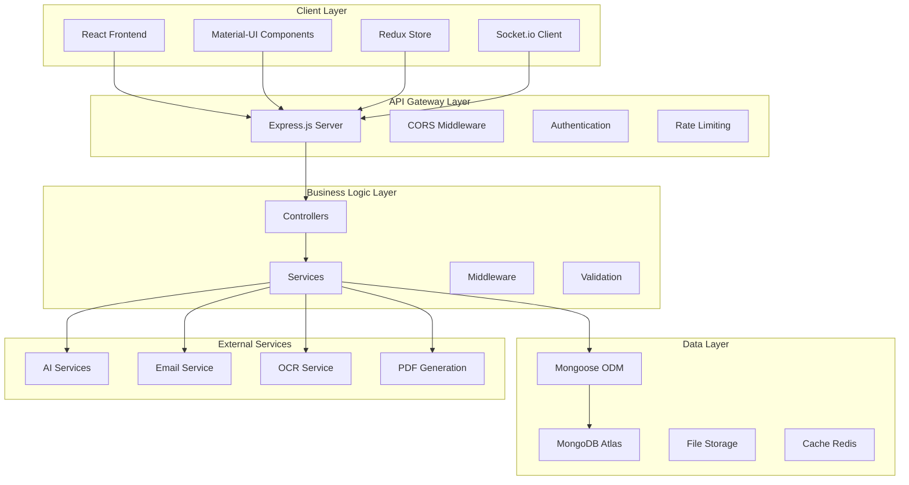

## 🎯 Architecture Détaillée par Couche

### 1. Frontend Layer (React/TypeScript)

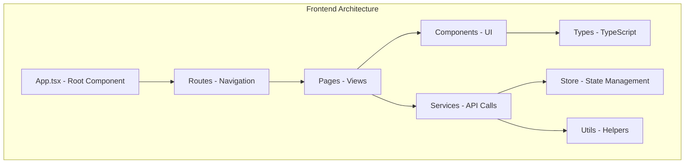

**Technologies Frontend :**
- **React 19.1.1** : Framework principal
- **TypeScript** : Typage statique
- **Material-UI 7.x** : Composants UI
- **Redux Toolkit** : Gestion d'état
- **React Router 6** : Navigation
- **Axios** : Client HTTP
- **Socket.io** : Communication temps réel
- **Recharts** : Visualisations
- **Formik + Yup** : Gestion des formulaires

### 2. Backend Layer (Node.js/Express)

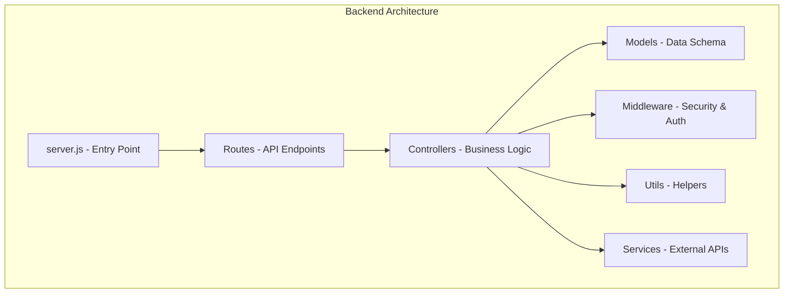

**Technologies Backend :**
- **Node.js 18+** : Runtime
- **Express.js 4.18** : Framework web
- **MongoDB 8.18** : Base de données
- **Mongoose** : ODM
- **JWT** : Authentification
- **Helmet** : Sécurité
- **Socket.io** : WebSockets
- **Multer** : Upload de fichiers
- **PDFKit** : Génération PDF
- **ExcelJS** : Génération Excel
- **Tesseract.js** : OCR
- **LangChain** : IA/ML

### 3. Base de Données (MongoDB)

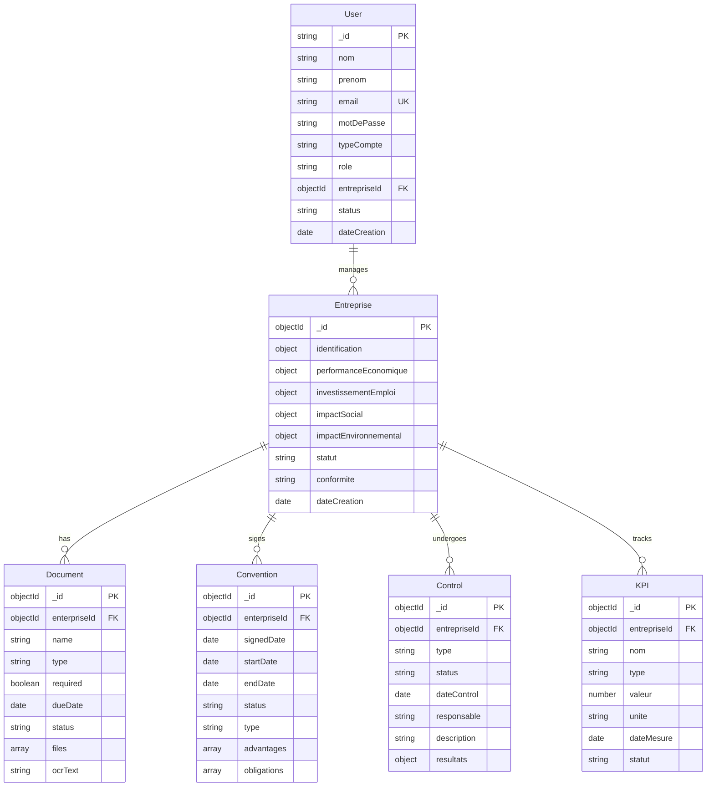

## 🔄 Flux de Données

### 1. Authentification et Autorisation

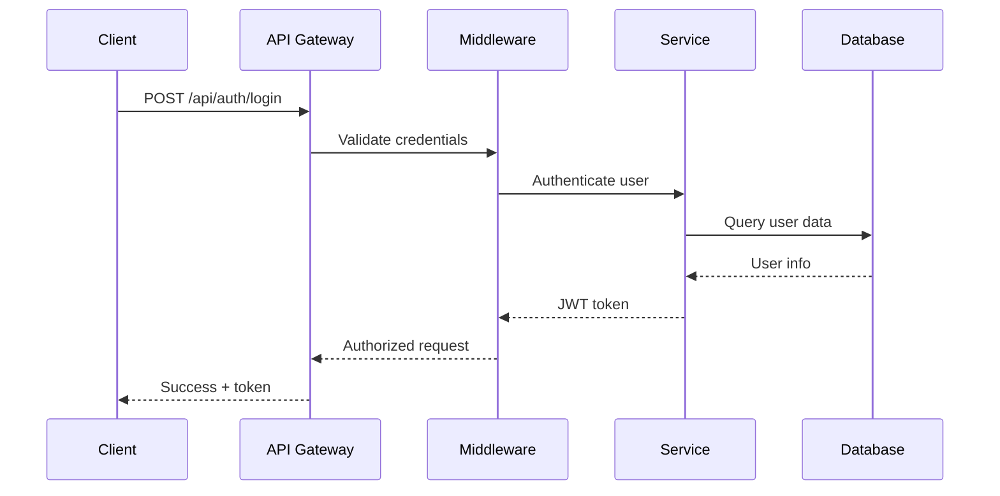

### 2. Gestion des Entreprises

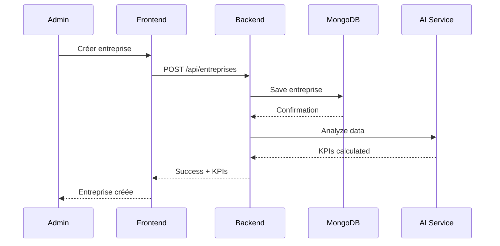

### 3. Système de Rapports

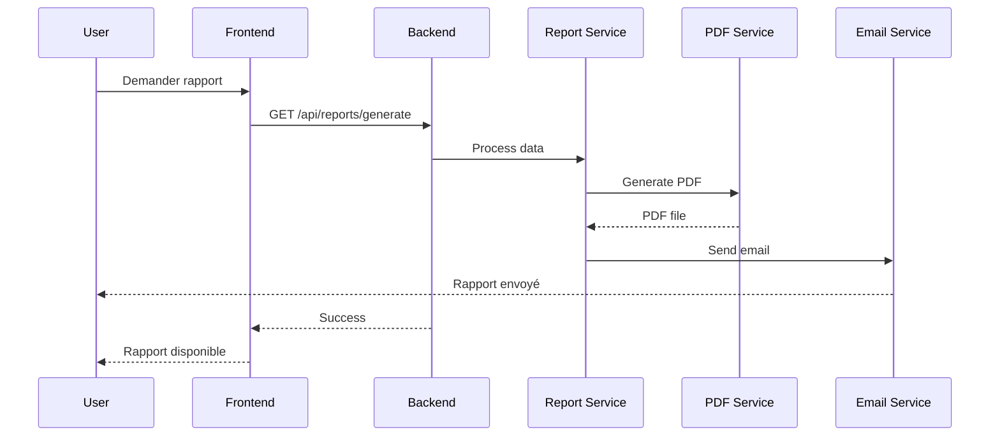

## 🛡️ Sécurité et Performance

### Architecture de Sécurité

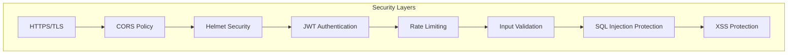

### Optimisations de Performance

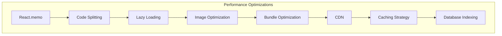

## 📊 Monitoring et Observabilité

### Architecture de Monitoring

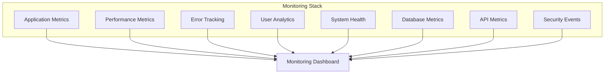

## 🚀 Déploiement et Infrastructure

### Architecture de Déploiement

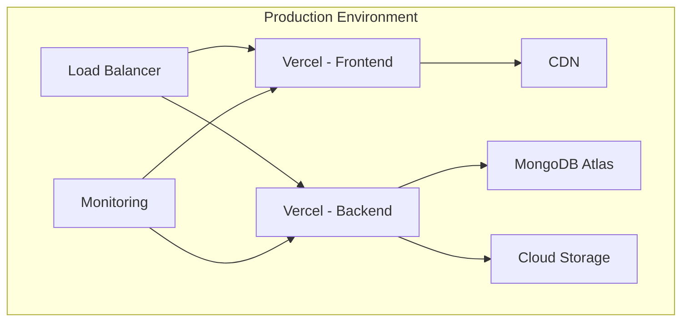

Cette architecture garantit :
- **Scalabilité** : Séparation des couches
- **Maintenabilité** : Code modulaire et typé
- **Sécurité** : Multiples couches de protection
- **Performance** : Optimisations à tous les niveaux
- **Observabilité** : Monitoring complet
