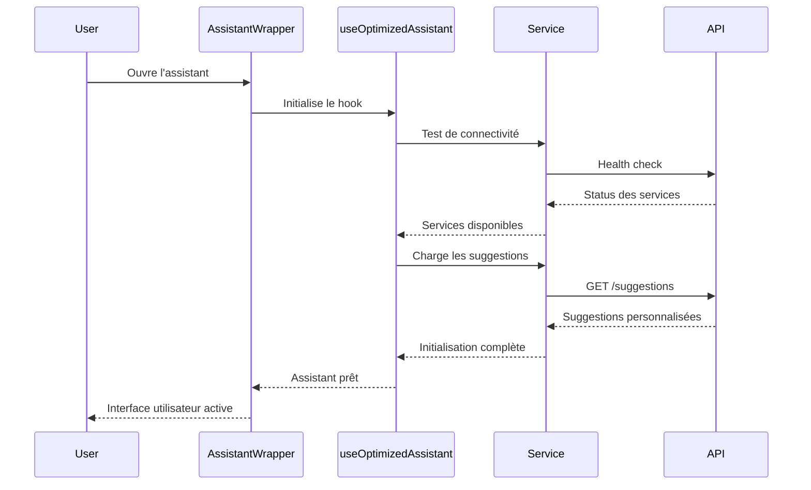
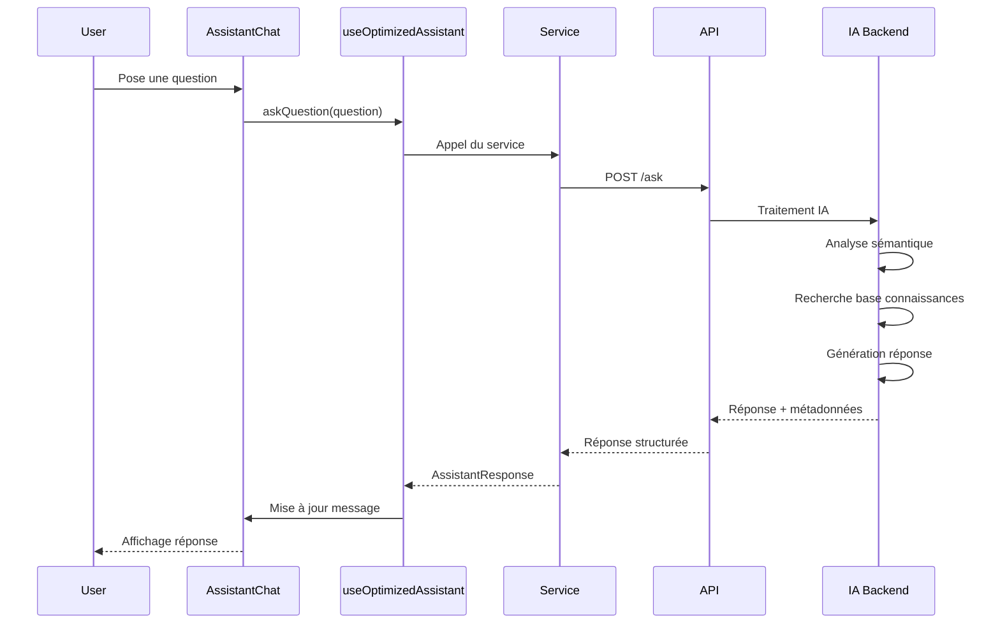
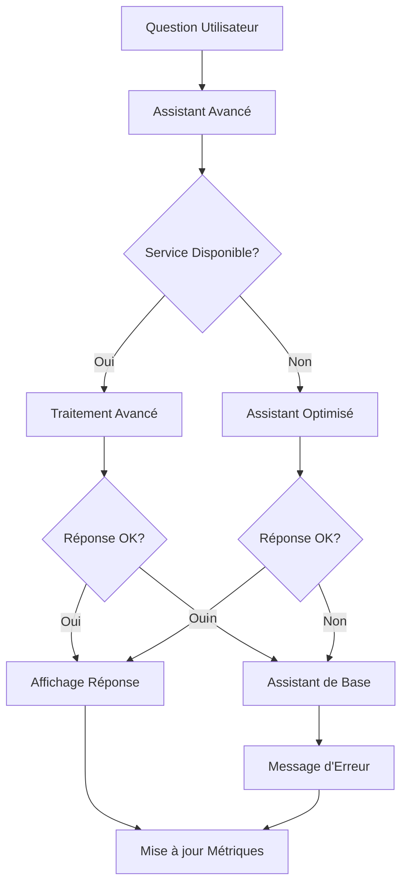

# Assistant de Discussion Principal - TrackImpact Monitor

## 🎯 Vue d'Ensemble

L'assistant de discussion principal de TrackImpact Monitor est un système d'intelligence artificielle sophistiqué qui utilise une architecture multi-niveaux avec des assistants spécialisés selon le rôle utilisateur (Administrateur vs Entreprise).

## 🏗️ Architecture de l'Assistant Principal

### 1. Structure des Composants

```mermaid
graph TB
    subgraph "Frontend - Interface Utilisateur"
        A[AssistantWrapper]
        B[AssistantChat]
        C[AssistantModal]
        D[AssistantFloatingButton]
    end
    
    subgraph "Hooks de Gestion d'État"
        E[useOptimizedAssistant]
        F[useAuth]
    end
    
    subgraph "Services Backend"
        G[optimizedAssistantService]
        H[advancedAssistantService]
        I[enhancedAssistantService]
    end
    
    subgraph "API Backend"
        J[/api/assistant]
        K[/api/advanced-assistant]
        L[/api/enhanced-assistant]
    end
    
    A --> B
    A --> C
    B --> E
    C --> E
    E --> G
    E --> H
    G --> J
    H --> K
    I --> L
```

### 2. Sélection Automatique de l'Assistant

L'application utilise un système de sélection intelligente qui choisit automatiquement le meilleur assistant selon :

- **Rôle utilisateur** : Admin vs Entreprise
- **Disponibilité des services** : Health check automatique
- **Fallback** : Assistant de base en cas de problème

```typescript
// Logique de sélection dans AssistantWrapper
if (user.typeCompte === 'admin' && health.admin) {
  // Assistant Admin Avancé
  endpoint = '/api/advanced-assistant/admin/ask';
} else if (user.typeCompte === 'enterprise' && health.enterprise) {
  // Assistant Entreprise Personnalisé
  endpoint = '/api/advanced-assistant/enterprise/ask';
} else {
  // Fallback vers Assistant Optimisé
  endpoint = '/api/assistant/ask';
}
```

## 🤖 Types d'Assistants Disponibles

### 1. Assistant Administrateur Avancé
- **Capacités** : Gestion système, monitoring, analyse prédictive
- **Endpoint** : `/api/advanced-assistant/admin/ask`
- **Fonctionnalités** :
  - Statistiques système en temps réel
  - Gestion des utilisateurs et entreprises
  - Monitoring de performance
  - Configuration système
  - Rapports d'audit et sécurité

### 2. Assistant Entreprise Personnalisé
- **Capacités** : KPIs, conseils métier, analyse de données
- **Endpoint** : `/api/advanced-assistant/enterprise/ask`
- **Fonctionnalités** :
  - Analyse des KPIs personnalisés
  - Conseils stratégiques
  - Suivi des objectifs
  - Rapports personnalisés
  - Recommandations d'amélioration

### 3. Assistant Optimisé (Fallback)
- **Capacités** : Fonctionnalités de base
- **Endpoint** : `/api/assistant/ask`
- **Fonctionnalités** :
  - Réponses génériques
  - Base de connaissances standard
  - Fonctionnalités essentielles

## 🔧 Technologies Utilisées

### Frontend Technologies

#### 1. **React 19.1.1 + TypeScript**
```typescript
// Interface des messages
interface Message {
  id: string;
  content: string;
  type: 'user' | 'assistant' | 'system';
  isUser: boolean;
  timestamp: Date;
  isLoading?: boolean;
  approach?: string;
  confidence?: number;
  responseTime?: number;
  metadata?: any;
  error?: boolean;
}
```

#### 2. **Material-UI 7.x**
- **Composants** : Dialog, Paper, Typography, TextField, IconButton
- **Animations** : Fade, Zoom pour les transitions fluides
- **Thème** : Personnalisation selon le rôle utilisateur
- **Responsive** : Adaptation mobile et desktop

#### 3. **React Markdown + Remark GFM**
```typescript
<ReactMarkdown
  remarkPlugins={[remarkGfm]}
  components={{
    p: ({ children }) => <Typography variant="body1" paragraph>{children}</Typography>,
    code: ({ children }) => <Box component="code" sx={{...}}>{children}</Box>,
    pre: ({ children }) => <Box component="pre" sx={{...}}>{children}</Box>
  }}
>
  {message.content}
</ReactMarkdown>
```

### Backend Technologies

#### 1. **Node.js + Express.js**
- **API REST** : Endpoints spécialisés par rôle
- **Middleware** : Authentification JWT, validation
- **Timeout** : 30 secondes pour les requêtes IA

#### 2. **Intelligence Artificielle**
- **LangChain** : Framework principal pour l'IA
- **Hugging Face** : Modèles de traitement du langage
- **Embeddings** : Recherche sémantique dans la base de connaissances
- **Vector Store** : Stockage et recherche vectorielle

#### 3. **Base de Connaissances**
- **MongoDB** : Stockage des données
- **FAISS** : Recherche vectorielle rapide
- **Cache Redis** : Optimisation des performances

## 🔄 Flux de Fonctionnement

### 1. Initialisation de l'Assistant



### 2. Traitement d'une Question



### 3. Gestion des Erreurs et Fallback



## 📊 Fonctionnalités Avancées

### 1. **Système de Cache Intelligent**
```typescript
class OptimizedAssistantService {
  private cache: Map<string, { data: any; timestamp: number; ttl: number }>;
  
  private getCacheKey(endpoint: string, params?: any): string {
    const paramString = params ? JSON.stringify(params) : '';
    return `${endpoint}_${btoa(paramString)}`;
  }
  
  private setCache(key: string, data: any, ttl: number = 300000): void {
    this.cache.set(key, {
      data,
      timestamp: Date.now(),
      ttl
    });
  }
}
```

### 2. **Déduplication des Requêtes**
```typescript
private async deduplicateRequest<T>(key: string, requestFn: () => Promise<T>): Promise<T> {
  if (this.requestQueue.has(key)) {
    return this.requestQueue.get(key) as Promise<T>;
  }
  
  const promise = requestFn().finally(() => {
    this.requestQueue.delete(key);
  });
  
  this.requestQueue.set(key, promise);
  return promise;
}
```

### 3. **Monitoring et Métriques**
```typescript
// Métriques en temps réel
const metrics = {
  totalQuestions: state.totalQuestions,
  averageResponseTime: state.averageResponseTime,
  successRate: state.successRate,
  cacheStats: optimizedAssistantService.getCacheStats()
};
```

### 4. **Health Check Automatique**
```typescript
// Vérification périodique de la santé des services
useEffect(() => {
  if (autoHealthCheck && state.isInitialized) {
    performHealthCheck();
    
    healthCheckIntervalRef.current = setInterval(
      performHealthCheck, 
      healthCheckInterval
    );
  }
}, [autoHealthCheck, state.isInitialized]);
```

## 🎨 Interface Utilisateur

### 1. **Design Adaptatif**
- **Admin** : Couleurs secondaires, icônes d'administration
- **Entreprise** : Couleurs primaires, icônes business
- **Animations** : Transitions fluides avec Fade et Zoom
- **Responsive** : Adaptation mobile et desktop

### 2. **Fonctionnalités UX**
- **Suggestions** : Questions prédéfinies selon le rôle
- **Feedback** : Système de notation des réponses
- **Copie** : Copie facile des réponses
- **Historique** : Sauvegarde des conversations
- **Métriques** : Affichage des performances

### 3. **Accessibilité**
- **Navigation clavier** : Support complet
- **Screen readers** : Compatible avec les lecteurs d'écran
- **Contraste** : Respect des standards d'accessibilité
- **Focus** : Gestion claire du focus

## 🔒 Sécurité et Performance

### 1. **Authentification**
```typescript
// Intercepteur d'authentification
this.api.interceptors.request.use((config) => {
  const token = localStorage.getItem('token');
  if (token) {
    config.headers.Authorization = `Bearer ${token}`;
  }
  return config;
});
```

### 2. **Validation des Données**
- **Sanitisation** : Nettoyage des entrées utilisateur
- **Validation** : Vérification des types et formats
- **Limitation** : Taille maximale des questions

### 3. **Optimisation des Performances**
- **Lazy Loading** : Chargement à la demande
- **Memoization** : Cache des calculs coûteux
- **Debouncing** : Éviter les requêtes multiples
- **Compression** : Optimisation des réponses

## 📈 Monitoring et Analytics

### 1. **Métriques Collectées**
- **Questions traitées** : Nombre total
- **Temps de réponse** : Moyenne et distribution
- **Taux de succès** : Pourcentage de réponses réussies
- **Utilisation du cache** : Hit rate et efficacité

### 2. **Alertes et Notifications**
- **Service dégradé** : Alerte automatique
- **Erreurs critiques** : Notification immédiate
- **Performance** : Seuils de performance

### 3. **Logs et Debugging**
```typescript
console.log(`🤔 [${requestId}] === ENVOI QUESTION FRONTEND ===`);
console.log(`📤 [${requestId}] Envoi question vers: ${this.baseURL}/ask`);
console.log(`📨 [${requestId}] Réponse reçue:`, {
  success: response.data.success,
  approach: response.data.approach,
  confidence: response.data.confidence
});
```

## 🚀 Évolutions Futures

### 1. **Améliorations Prévues**
- **Voice Interface** : Support vocal
- **Multimodal** : Images et documents
- **Personnalisation** : Apprentissage des préférences
- **Collaboration** : Conversations partagées

### 2. **Optimisations Techniques**
- **Edge Computing** : Traitement local
- **Streaming** : Réponses en temps réel
- **Offline** : Mode hors ligne
- **PWA** : Application progressive

Cette architecture sophistiquée garantit une expérience utilisateur optimale avec des réponses intelligentes, adaptées au rôle de l'utilisateur et avec une robustesse technique élevée.
