# Diagrammes de Cas d'Utilisation - TrackImpact Monitor

## 🎯 Vue d'ensemble des Acteurs

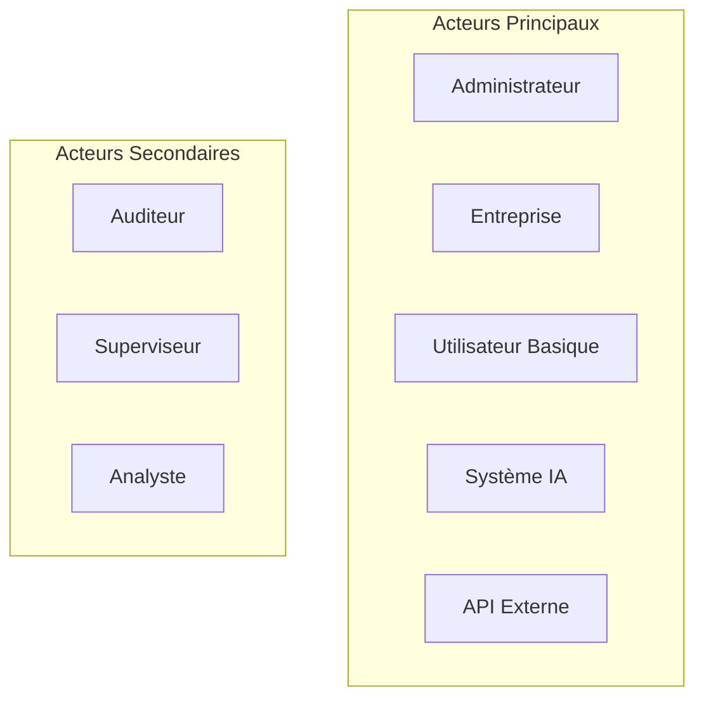

## 📋 Cas d'Utilisation Principaux

### 1. Gestion des Utilisateurs

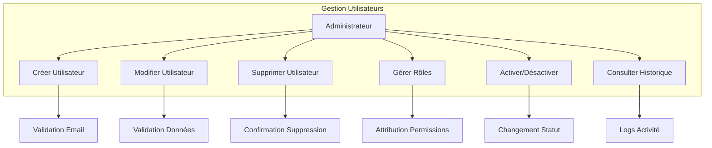

### 2. Gestion des Entreprises

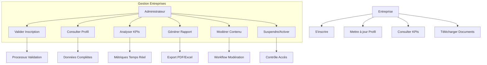

### 3. Système de Rapports

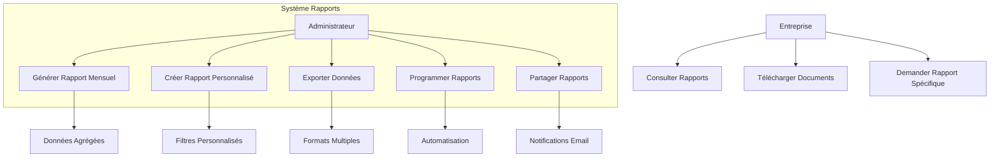

### 4. Système de Monitoring

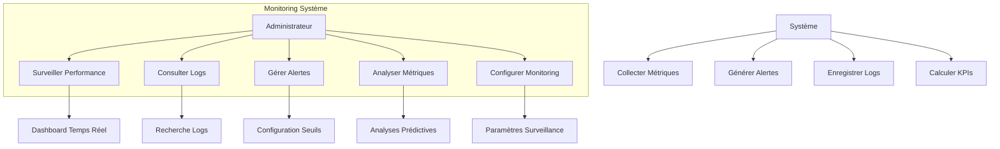

## 🤖 Système d'Intelligence Artificielle

### 1. Assistant IA Administrateur

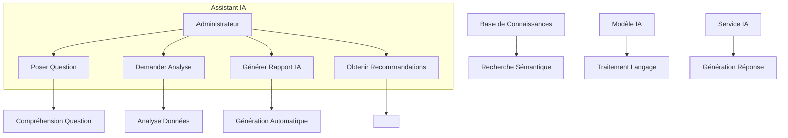

### 2. Analyse Prédictive

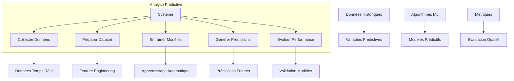

## 🔄 Workflows Métier

### 1. Processus d'Inscription Entreprise

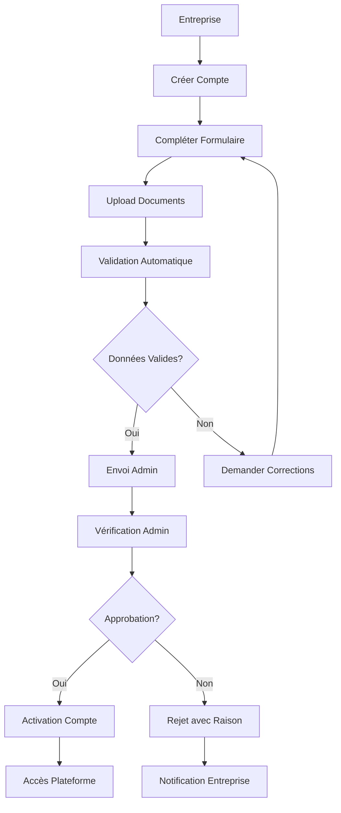

### 2. Processus de Validation Document

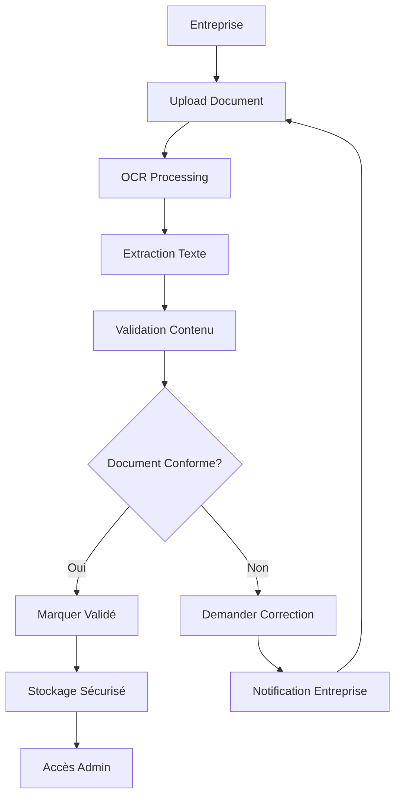

### 3. Workflow de Génération Rapport

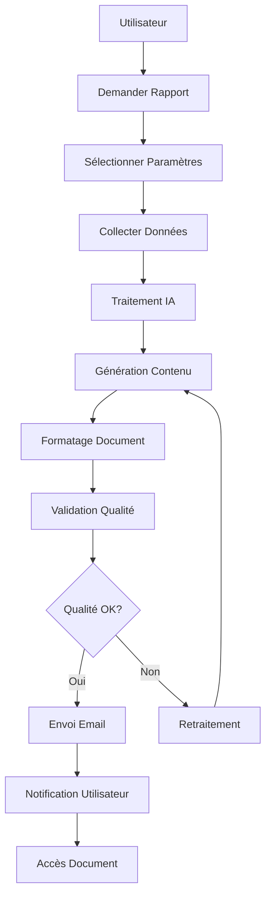

## 📊 Cas d'Utilisation Spécialisés

### 1. Gestion des Conventions

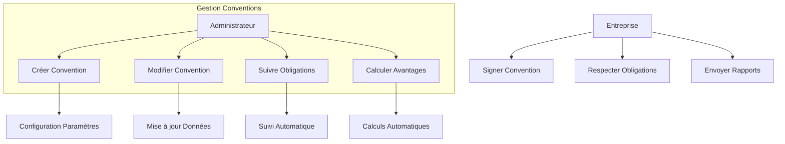

### 2. Système de Contrôles

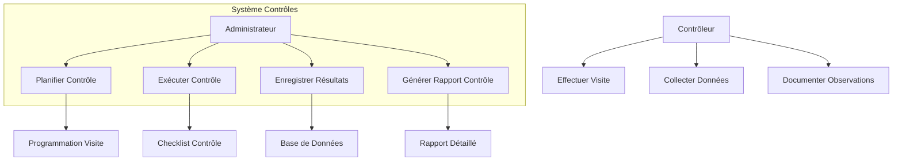

## 🔐 Sécurité et Conformité

### 1. Gestion des Accès

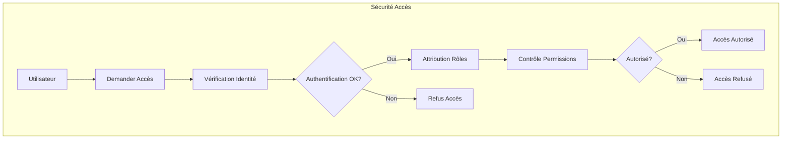

### 2. Audit et Conformité

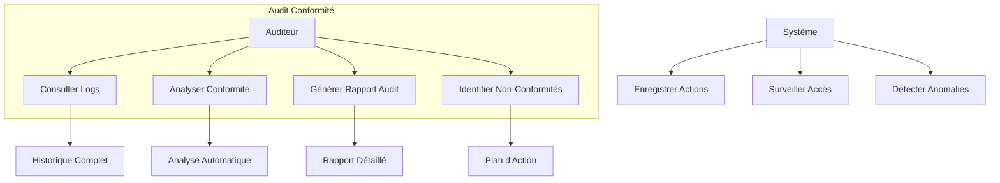

Ces diagrammes de cas d'utilisation illustrent la complexité et la richesse fonctionnelle de la plateforme TrackImpact Monitor, couvrant tous les aspects de la gestion d'entreprises, du monitoring, et de l'intelligence artificielle.
