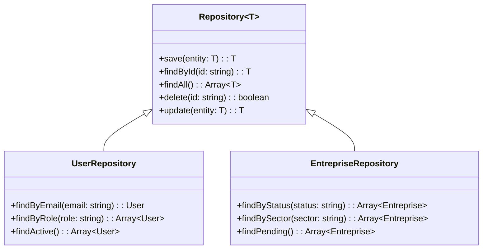
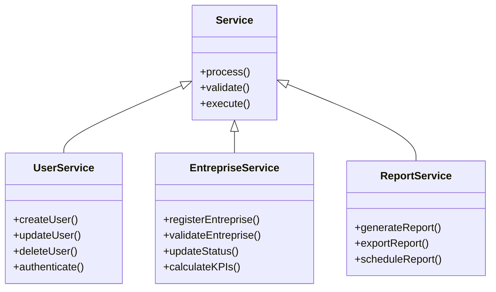
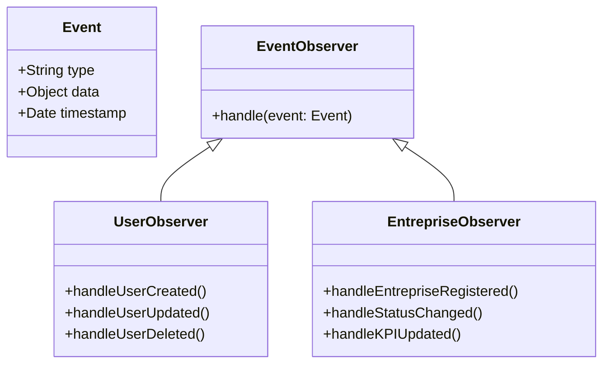

# Diagrammes de Classes - TrackImpact Monitor

## 🏗️ Architecture des Classes Principales

### 1. Modèle de Données Core

```mermaid
classDiagram
    class User {
        +ObjectId _id
        +String nom
        +String prenom
        +String email
        +String motDePasse
        +String typeCompte
        +String role
        +ObjectId entrepriseId
        +String status
        +Date dateCreation
        +String telephone
        +String avatar
        +String adresse
        +login()
        +logout()
        +updateProfile()
        +changePassword()
    }
    
    class Entreprise {
        +ObjectId _id
        +Object identification
        +Object performanceEconomique
        +Object investissementEmploi
        +Object impactSocial
        +Object impactEnvironnemental
        +String statut
        +String conformite
        +Date dateCreation
        +Object contact
        +Boolean informationsCompletes
        +register()
        +updateInfo()
        +validate()
        +suspend()
        +activate()
    }
    
    class Document {
        +ObjectId _id
        +ObjectId enterpriseId
        +String name
        +String type
        +Boolean required
        +Date dueDate
        +String status
        +Array files
        +String ocrText
        +Number ocrConfidence
        +upload()
        +validate()
        +extractText()
        +download()
    }
    
    User ||--o{ Entreprise : manages
    Entreprise ||--o{ Document : has
```

### 2. Système de Gestion des Conventions

```mermaid
classDiagram
    class Convention {
        +ObjectId _id
        +ObjectId enterpriseId
        +Date signedDate
        +Date startDate
        +Date endDate
        +String status
        +String type
        +Array advantages
        +Array obligations
        +Array indicators
        +Array documents
        +Array history
        +Object metadata
        +sign()
        +update()
        +terminate()
        +addAdvantage()
        +addObligation()
        +trackProgress()
    }
    
    class Advantage {
        +String type
        +String description
        +Date validUntil
        +String conditions
        +Boolean active
        +validate()
        +expire()
    }
    
    class Obligation {
        +String type
        +String description
        +Number targetValue
        +Date deadline
        +String unit
        +Number currentValue
        +Boolean completed
        +checkCompliance()
        +updateProgress()
    }
    
    Convention ||--o{ Advantage : contains
    Convention ||--o{ Obligation : contains
```

### 3. Système de Contrôles et Audit

```mermaid
classDiagram
    class Control {
        +ObjectId _id
        +ObjectId entrepriseId
        +String type
        +String status
        +Date dateControl
        +String responsable
        +String description
        +String observations
        +String recommendations
        +Object resultats
        +Array documents
        +Array historique
        +plan()
        +execute()
        +complete()
        +cancel()
        +addObservation()
        +generateReport()
    }
    
    class NonConformite {
        +String description
        +String gravite
        +String actionCorrective
        +Date dateLimite
        +String status
        +String responsable
        +Date dateResolution
        +identify()
        +assign()
        +resolve()
        +escalate()
    }
    
    class AuditLog {
        +ObjectId _id
        +String action
        +ObjectId userId
        +ObjectId targetId
        +String targetType
        +Object details
        +Date timestamp
        +String ipAddress
        +String userAgent
        +log()
        +search()
        +export()
    }
    
    Control ||--o{ NonConformite : identifies
    Control ||--o{ AuditLog : generates
```

### 4. Système de KPIs et Indicateurs

```mermaid
classDiagram
    class KPI {
        +ObjectId _id
        +ObjectId entrepriseId
        +String nom
        +String type
        +Number valeur
        +String unite
        +Date dateMesure
        +String statut
        +Number objectif
        +Number seuilMin
        +Number seuilMax
        +String description
        +measure()
        +calculate()
        +evaluate()
        +alert()
    }
    
    class Indicator {
        +ObjectId _id
        +String name
        +String type
        +String category
        +String description
        +String formula
        +String unit
        +Number weight
        +Boolean active
        +Array dependencies
        +calculate()
        +validate()
        +update()
    }
    
    class IndicatorValue {
        +ObjectId _id
        +ObjectId indicatorId
        +ObjectId enterpriseId
        +Number value
        +Date measurementDate
        +String source
        +Number confidence
        +Boolean validated
        +record()
        +validate()
        +update()
    }
    
    KPI ||--|| Indicator : based_on
    Indicator ||--o{ IndicatorValue : has_values
```

### 5. Système de Rapports

```mermaid
classDiagram
    class Report {
        +ObjectId _id
        +String type
        +String title
        +String description
        +ObjectId createdBy
        +Date createdAt
        +Date updatedAt
        +String status
        +Object parameters
        +Array data
        +String format
        +String filePath
        +generate()
        +export()
        +schedule()
        +send()
    }
    
    class ReportTemplate {
        +ObjectId _id
        +String name
        +String type
        +Object structure
        +Array sections
        +Object styling
        +Boolean active
        +create()
        +update()
        +clone()
        +apply()
    }
    
    class ReportSchedule {
        +ObjectId _id
        +ObjectId reportId
        +String frequency
        +Date nextRun
        +Array recipients
        +Boolean active
        +schedule()
        +execute()
        +pause()
        +resume()
    }
    
    Report ||--|| ReportTemplate : uses
    Report ||--o{ ReportSchedule : scheduled_by
```

### 6. Système d'Intelligence Artificielle

```mermaid
classDiagram
    class AIAssistant {
        +String id
        +String type
        +Object config
        +Array capabilities
        +Boolean active
        +askQuestion()
        +analyzeData()
        +generateResponse()
        +learn()
        +update()
    }
    
    class KnowledgeBase {
        +String id
        +String name
        +Array entries
        +Number totalEntries
        +Date lastUpdated
        +String version
        +search()
        +addEntry()
        +updateEntry()
        +deleteEntry()
        +reload()
    }
    
    class AIResponse {
        +String id
        +String question
        +String answer
        +String approach
        +Number confidence
        +Number responseTime
        +Object metadata
        +Date timestamp
        +evaluate()
        +improve()
    }
    
    AIAssistant ||--o{ KnowledgeBase : uses
    AIAssistant ||--o{ AIResponse : generates
```

### 7. Système de Collaboration

```mermaid
classDiagram
    class Discussion {
        +ObjectId _id
        +String title
        +String description
        +ObjectId createdBy
        +Array participants
        +Array messages
        +String status
        +Date createdAt
        +Date updatedAt
        +create()
        +addMessage()
        +addParticipant()
        +close()
    }
    
    class Message {
        +ObjectId _id
        +ObjectId discussionId
        +ObjectId authorId
        +String content
        +String type
        +Array attachments
        +Date timestamp
        +Boolean edited
        +send()
        +edit()
        +delete()
        +react()
    }
    
    class Workflow {
        +ObjectId _id
        +String name
        +String type
        +Array steps
        +Array approvers
        +String status
        +ObjectId instanceId
        +create()
        +start()
        +approve()
        +reject()
        +complete()
    }
    
    Discussion ||--o{ Message : contains
    Workflow ||--o{ Discussion : creates
```

### 8. Système de Monitoring

```mermaid
classDiagram
    class SystemMetrics {
        +ObjectId _id
        +Number cpuUsage
        +Number memoryUsage
        +Number diskUsage
        +Number networkUsage
        +Number responseTime
        +Number uptime
        +Date timestamp
        +collect()
        +analyze()
        +alert()
    }
    
    class SecurityAlert {
        +ObjectId _id
        +String type
        +String severity
        +String description
        +ObjectId userId
        +String ipAddress
        +Date timestamp
        +String status
        +detect()
        +escalate()
        +resolve()
    }
    
    class PerformanceAlert {
        +ObjectId _id
        +String metric
        +Number threshold
        +Number currentValue
        +String severity
        +Date timestamp
        +String status
        +trigger()
        +notify()
        +resolve()
    }
    
    SystemMetrics ||--o{ SecurityAlert : triggers
    SystemMetrics ||--o{ PerformanceAlert : triggers
```

## 🔄 Relations Inter-Classes

### Diagramme de Relations Globales

```mermaid
classDiagram
    class User {
        +ObjectId _id
        +String email
        +String role
    }
    
    class Entreprise {
        +ObjectId _id
        +String statut
        +Object identification
    }
    
    class Document {
        +ObjectId _id
        +String type
        +String status
    }
    
    class Convention {
        +ObjectId _id
        +String status
        +Date signedDate
    }
    
    class KPI {
        +ObjectId _id
        +String nom
        +Number valeur
    }
    
    class Report {
        +ObjectId _id
        +String type
        +String status
    }
    
    class AIAssistant {
        +String id
        +Array capabilities
    }
    
    User ||--o{ Entreprise : manages
    Entreprise ||--o{ Document : has
    Entreprise ||--o{ Convention : signs
    Entreprise ||--o{ KPI : tracks
    User ||--o{ Report : creates
    AIAssistant ||--o{ User : assists
    AIAssistant ||--o{ Entreprise : analyzes
```

## 🎯 Patterns de Conception Utilisés

### 1. Repository Pattern


### 2. Service Layer Pattern


### 3. Observer Pattern pour les Événements


Cette architecture de classes illustre la complexité et la richesse du système TrackImpact Monitor, avec une séparation claire des responsabilités et des patterns de conception appropriés pour une application enterprise.
