# Représentations Visuelles de l'Architecture TrackImpact Monitor

## 🏗️ 1. Architecture Générale 3-Tiers

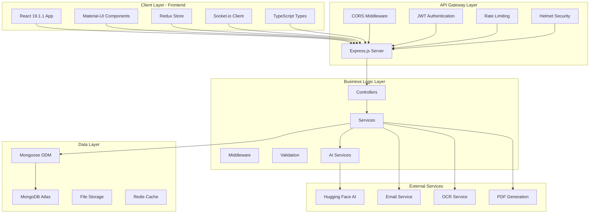

## 🎯 2. Architecture Frontend Détaillée

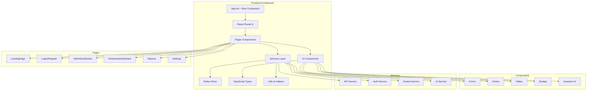

## 🔧 3. Architecture Backend Détaillée

```mermaid
graph TB
    subgraph "Backend Architecture"
        A[server.js - Entry Point]
        B[Express App]
        C[Middleware Stack]
        D[Routes]
        E[Controllers]
        F[Services]
        G[Models]
        H[Utils]
    end
    
    subgraph "Middleware"
        I[CORS]
        J[Helmet]
        K[Rate Limiting]
        L[Auth Middleware]
        M[Validation]
        N[Logging]
    end
    
    subgraph "Routes"
        O[/api/auth]
        P[/api/admin]
        Q[/api/entreprises]
        R[/api/reports]
        S[/api/ai-chat]
        T[/api/enhanced-assistant]
    end
    
    subgraph "Controllers"
        U[AuthController]
        V[AdminController]
        W[EntrepriseController]
        X[ReportController]
        Y[AIController]
    end
    
    subgraph "Services"
        Z[DatabaseService]
        AA[EmailService]
        BB[AI Service]
        CC[PDFService]
        DD[OCRService]
    end
    
    A --> B
    B --> C
    C --> D
    D --> E
    E --> F
    F --> G
    F --> H
    
    C --> I
    C --> J
    C --> K
    C --> L
    C --> M
    C --> N
    
    D --> O
    D --> P
    D --> Q
    D --> R
    D --> S
    D --> T
    
    E --> U
    E --> V
    E --> W
    E --> X
    E --> Y
    
    F --> Z
    F --> AA
    F --> BB
    F --> CC
    F --> DD
```

## 🗄️ 4. Modèle de Données - Relations

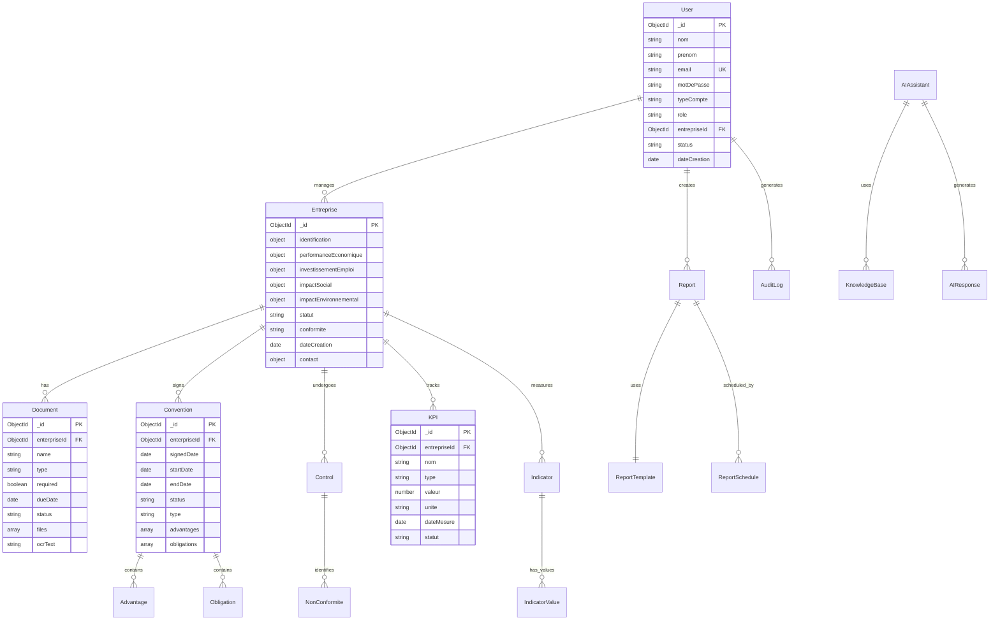

## 🔄 5. Flux de Données - Authentification

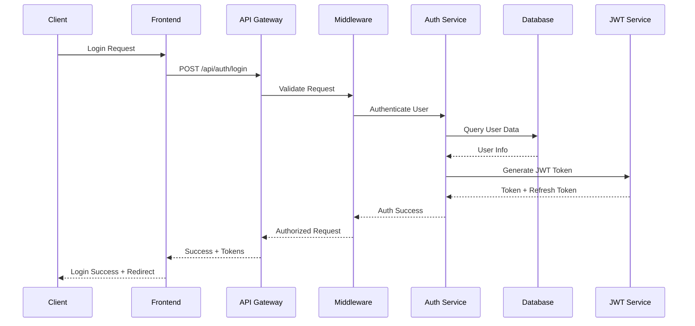

## 📊 6. Flux de Données - Gestion Entreprise

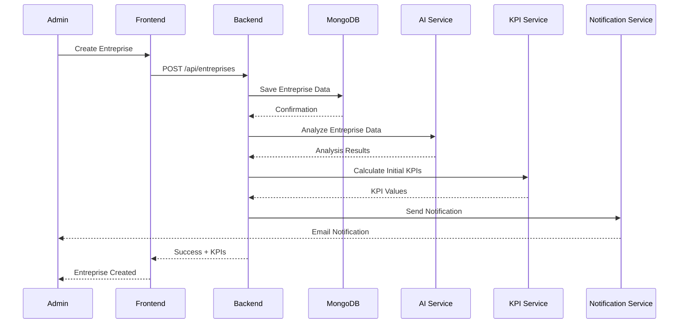

## 🤖 7. Architecture Intelligence Artificielle

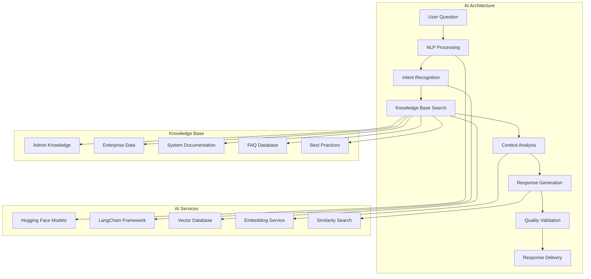

## 🔐 8. Architecture de Sécurité

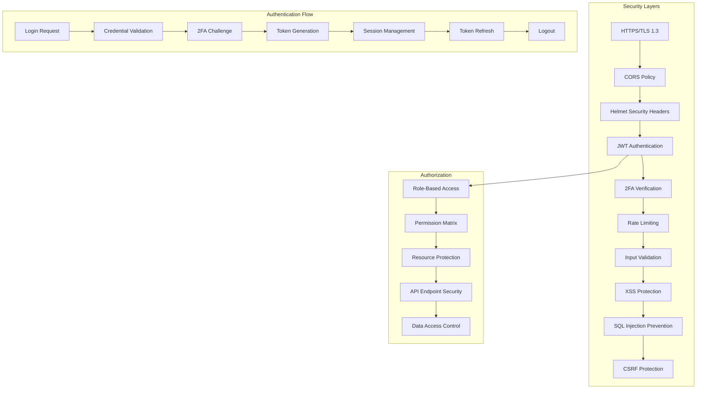

## 📈 9. Architecture de Monitoring

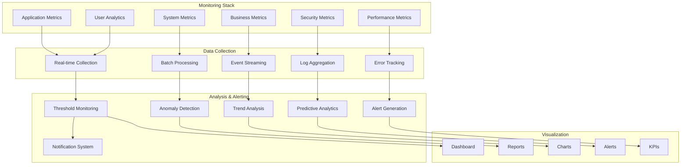

## 🚀 10. Architecture de Déploiement

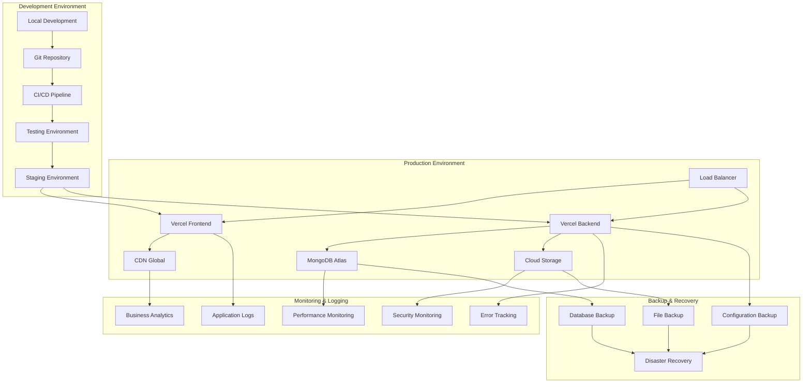

## 🔄 11. Flux de Communication Temps Réel

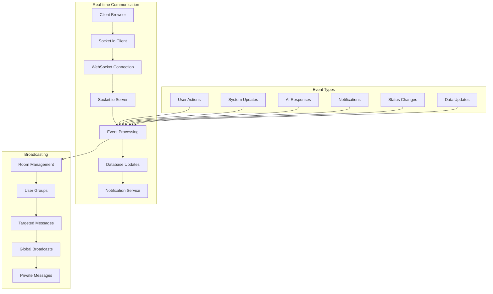

## 📋 12. Architecture des Rapports

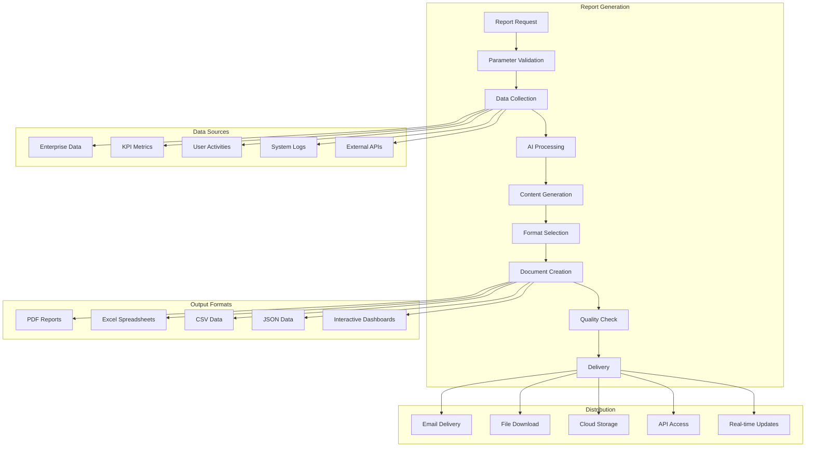

Ces diagrammes visuels offrent une représentation complète et détaillée de l'architecture technique de TrackImpact Monitor, couvrant tous les aspects de l'infrastructure, des flux de données, de la sécurité, du monitoring et des fonctionnalités avancées.
