# Processus Métier - TrackImpact Monitor

## 🎯 Vue d'ensemble des Processus Métier

### 1. Processus d'Inscription et Validation des Entreprises

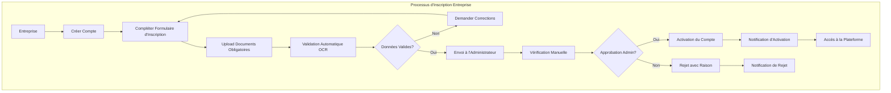

### 2. Processus de Gestion des Conventions

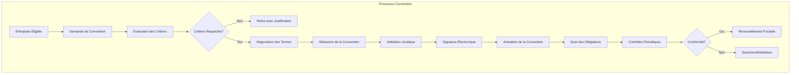

### 3. Processus de Contrôle et Audit

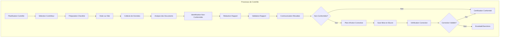

## 📊 Processus de Gestion des KPIs

### 1. Collecte et Calcul des Indicateurs

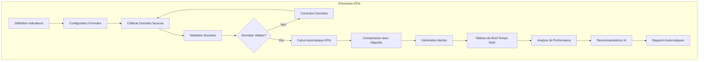

### 2. Processus d'Analyse Prédictive

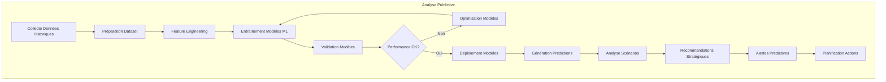

## 🔄 Processus de Collaboration

### 1. Workflow d'Approbation

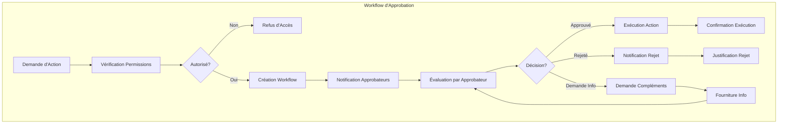

### 2. Processus de Discussion et Collaboration

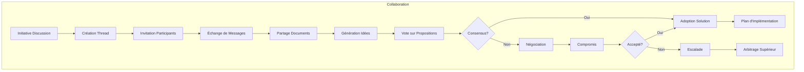

## 📋 Processus de Génération de Rapports

### 1. Processus de Création de Rapports

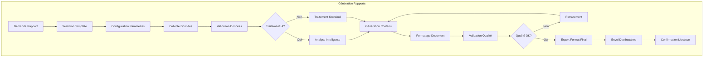

### 2. Processus de Planification Automatique

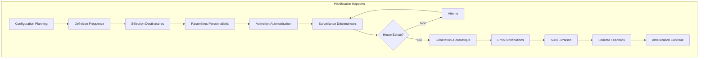

## 🔐 Processus de Sécurité et Conformité

### 1. Processus d'Authentification

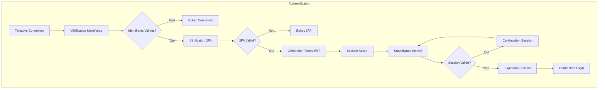

### 2. Processus d'Audit de Sécurité

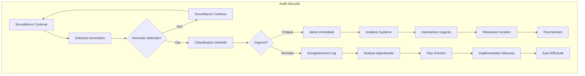

## 🤖 Processus d'Intelligence Artificielle

### 1. Processus d'Assistant IA

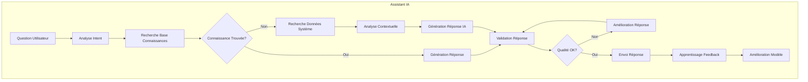

### 2. Processus d'Analyse Prédictive

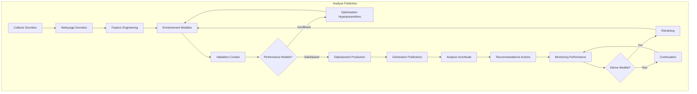

## 📈 Processus de Monitoring et Performance

### 1. Processus de Surveillance Système

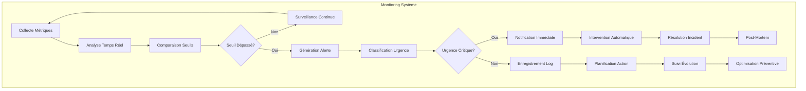

### 2. Processus d'Optimisation Continue

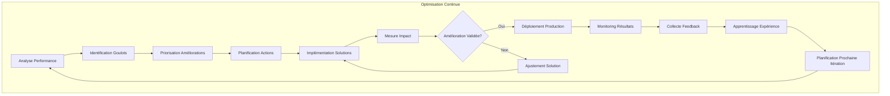

Ces processus métier illustrent la complexité et l'interconnexion des différents aspects de la plateforme TrackImpact Monitor, couvrant tous les aspects de la gestion d'entreprises, du monitoring, de l'IA et de la collaboration.
